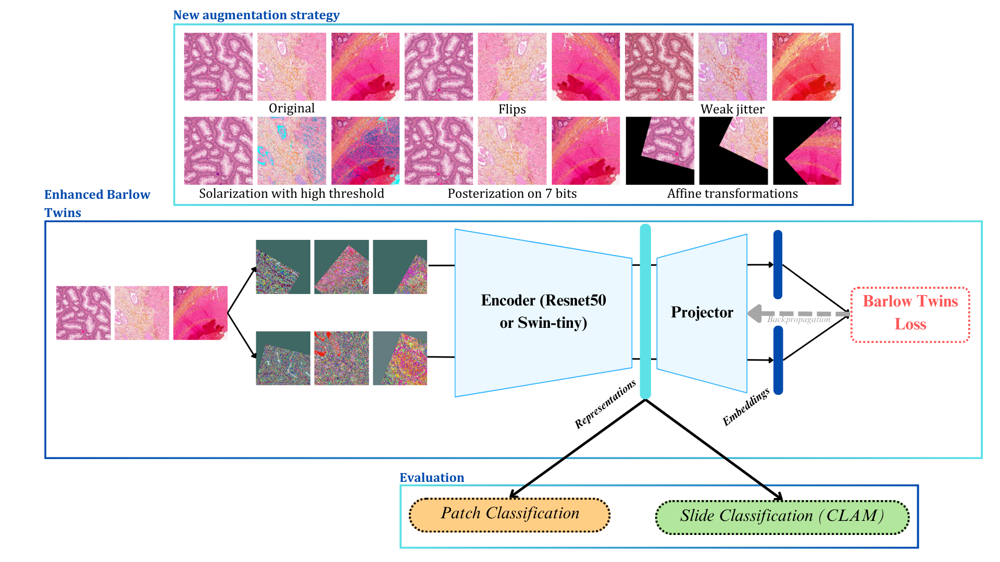

# Enhanced Barlow Twins for Colorectal Polyp Screening
🚀 We propose an optimized Barlow Twins for colorectal polyp screening. The augmentation strategy was carefully studied to fit our dataset, a dataset from Kingston General Hospital made of 1037 WSIs from pathology (Hyperplatis Polyps, Sessile Serrated Lesions, Tubular Adenoma, Tubulovillous Adenoma) and histology colon. Using ResNet50 or Swin-Tiny, our porposed models perfom better than the basic Barlow Twins on the patch level and better than the basic Barlow Twins with limited data on the slide level.
<div align="center">
  
</div>

## 🔍 What is PathBT ?
<div align="center">
  
</div>

### Augmentation strategy
🎨 We adapt Barlow Twins augmentation strategy, including GrayScale, GaussianBlur, Solarization, ColorJitter, to the very specific pathology data. After an ablation study, we conclude that the best transformation strategy include a weak color jitter, a solarization with a high threshold, high posterization. The augmentation strategy is presented in `class TransformPath` in [factory.py](pathBT/factory.py)
### Encoder
As Swin Transformer maps the hierarchy of the pathology data, it acts as a local-global feature extractor and has shown remarkable results on diverse pathology dataset ([1](https://www.sciencedirect.com/science/article/pii/S1361841522002043),[2](https://pubmed.ncbi.nlm.nih.gov/36318158/)). We propose to compare [ResNet-50](https://pytorch.org/vision/main/models/generated/torchvision.models.resnet50.html) with [swin_tiny](https://pytorch.org/vision/main/models/generated/torchvision.models.swin_t.html?highlight=swin+t#torchvision.models.swin_t) within Barlow Twins frameworks.
### Datasets
The dataset used for the development of PathBT is a private dataset of 1037 WSIs from Kingston General Hospital, presenting with 5 classes of tissues: normal, hyperplastic polyps, sessile serrated lesions, tubular adenoma and tubulovillous adenoma. This dataset is annotated on the ROI level. We evaluated our frameworks on 4 different datasets from this private dataset, built on 4 different Fields of view. Barlow Twins was trained on all patches from the slides, and the linear evaluation is performed on the patches from the ROI. PathBT (with resnet50 or swin-t) was also evaluated on [PCam](https://github.com/basveeling/pcam) dataset. Downstream tasking was performed on [CRC](https://paperswithcode.com/dataset/crc) and [MHIST](https://bmirds.github.io/MHIST/) datasets.
## 🎯 Results
We evaluate the modes on the patch and slide level:
- on the patch level, we train a linear layer on top of the frozen backbone;
- on the slide level, we train [CLAM](https://github.com/mahmoodlab/CLAM) framework on the frozen backbone.
For downstream tasking, we train a linear layer on top of the frozen backbone (pretrained on KGH datasets)
Results are also compared with the pretrained weights of this following [work)(https://lunit-io.github.io/research/publications/pathology_ssl/) where a ResNet-50 encoder was trained in Barlow Twins setting on a very large cohort of 36K WSIs.
### Patch-level classification on KGH datasets
The training dataset to train the linear layer is a balanced set of 3500 patches per class. The test set is a balanced set of 300 patches per class from the test slides. All patches where randomly chosen.
We report the accuracy and AUC (below) of the different models.
| Dataset-FoV      | RN-50 sup | Swin-T sup | basicBT | imBT | benchBT | pathBT | swinBT |
| ------------- | ------------- |------------- |------------- |------------- |------------- |------------- |------------- |
| pkgh-1400 | 81.85 |82.67|78.77|81.32|75.86|83.43|86.15|
|           | 0.893 | 0.9119 |0.9592 | 0.9618 |0.8478|0.9652|0.9764|
| pkgh-800 | 80.6 | 84.17 | 81.27 | 81.3 | 75.9 | 83.84 | 86.47 |
|          | 0.909 | 0.9161 | 0.9668 | 0.9576 | 0.842 | 0.9676 | 0.9822 |
| pkgh-600 | 81.43 | 83.17 | 80.54 | 82.26 | 74.9 | 81.84 | 84.17 |
|          | 0.91 | 0.8519 | 0.9613 |0.9613 | 0.8424 | 0.9599 | 0.9728 |
| pkgh-410 | 80.52 | 80.86 | 80.06 | 82.57 | 74.03 | 80.4 | 82.37 |
|          | 0.8774 | 0.8965 | 0.9720 | 0.9649 |0.8427 |0.9515 |0.9657 |
### Slide-level classification on KGH datasets
We report the accuracy and AUC (below) of the MIL models trained on the different encoders.
| Dataset-FoV      | RN-50 sup | Swin-T sup | basicBT | imBT | benchBT | pathBT | swinBT |
| ------------- | ------------- |------------- |------------- |------------- |------------- |------------- |------------- |
| pkgh-1400 | 87.08 | 87.67 | 86.3 | 90.41 | 80.82 |91.8|91.78|
|           | 0.9647|0.9807|0.9819|0.9854|0.9552|0.9862|0.9908|
| pkgh-800 | 91.78 |91.78|94.52|91.7|89.04|89.04|87.67|
|          | 0.9935 |0.9951|0.9894|0.9899|0.976|0.9812|0.9891|
|pkgh-600|87.67|89.04|89.04|91.8|.|89.04|93.15 |
|        |0.9856|0.9908|0.9842|0.9896|.|0.9812|0.9932|
|pkgh-410|91.78|87.67|90.41|95.89|.|87.67|89.04|
|        |0.9905|0.984|0.9941|0.9966|.|0.9819|0.992|
### Patch-level classification on PCam dataset
We train the encoders in similar settings as in the experiment above on PCam training set. We use Barlow Twins with a batch size of 256.
The validation set of PCam is used as a training set for the linear evaluation and we report in the Table below the test accuracy from PCam test set.
| | basicBT | imBT | benchBT | pathBT | swinBT |
| ------------- | ------------- |------------- |------------- |------------- |------------- |
|69.2 |69.84|88.79|70.5|79.63|

### Downstream tasking on CRC & MHIST
We use the pre-trained encoder on pkgh, pkgh-800 and pkgh-600 and perform a linear evaluation to evaluate the generalizability of the embedded features to MHIST and NCT-CRC-7k. We report the accuracy and AUC in the Table below:
First, for MHIST
  
| Models | pkgh |pkgh-800 |pkgh-600 |
| ------------- | ------------- |------------- |------------- |
|basicBT |82.8|82.9|83.44|
|      |0.8267 |0.8338|0.8344|
|imBT | 81.68|81.17|83.11|
|     | 0.8084|0.8179|0.8304|
|pathBT| 76.05 |74.63 |73.92 |
|      | 0.7563 |0.7392|0.7361|
|swinBT|79.12 |76.56|77.79|
|      | 0.7634 |0.7408|0.7628|

## 🖌️ Explainability of the results
### Confusion matrices
### GradCAM & SHAP
### CLAM

## 🦾 To train your own pathBT
### Environment
To install the environment used for these experiments, you can use `virtualenv`:
- first create the environment `virtualenv barlow-env`;
- activate it `source barlow-env/bin/activate`;
- install all necessary packages `pip install -r requirements-barlow.txt`;

NOTA BENE:
- for CLAM experiments, a conda environement is provided (see [config file](Clam/env.yml));
- for GradCAM, the authors provide their own environement as well or you can install it with `pip install grad-cam` (documentation [here](https://github.com/jacobgil/pytorch-grad-cam));
- for SHAP, the authors provide a library which you can install with `pip install shap` (documentation [here](https://pypi.org/project/shap/)).
### Datasets
### Scripts
To train a ResNet-50 encoder with the proposed augmentation strategy, you can run
```python
torchrun --rdzv-backend=c10d --rdzv-endpoint=localhost:0 --nnodes=1 --nproc-per-node=1 /pathBT/main.py \
    --backbone resnet50 --dataset pkgh \
    --pretrained imagenet"--transform patho \
    --epochs 100  --batch-size 512 \
    --projector "8192-8192-8192"  \
    --checkpoint-dir your/model/directory \
```
To train a Swin Tiny encoder with the proposed augmentation strategy, you can run
```python
torchrun --rdzv-backend=c10d --rdzv-endpoint=localhost:0 --nnodes=1 --nproc-per-node=1 /pathBT/main.py \
    --backbone swin_t --dataset pkgh \
    --pretrained imagenet"--transform patho \
    --epochs 100  --batch-size 512 \
    --projector "8192-8192-8192"  \
    --checkpoint-dir your/model/directory \
```
To train a ResNet encoder in the basic Barlow Twins settings, you can run
```python
torchrun --rdzv-backend=c10d --rdzv-endpoint=localhost:0 --nnodes=1 --nproc-per-node=1 /pathBT/main.py \
    --backbone resnet50 --dataset pkgh \
    --epochs 100  --batch-size 512 \
    --projector "8192-8192-8192"  \
    --checkpoint-dir your/model/directory \
```
If you need Weights&Biases support, you can set `--wandb True` and precise your login key with `--wandb_login your-key`
## 🔽 Download the models
All models trained KGH dataset (trained with Barlow Twins or in a supervised manner) can be found in this [folder](https://drive.google.com/drive/folders/1Ut-Tsly1kSpRl6Jh_MgyVocQZG59dWcb?usp=sharing)
